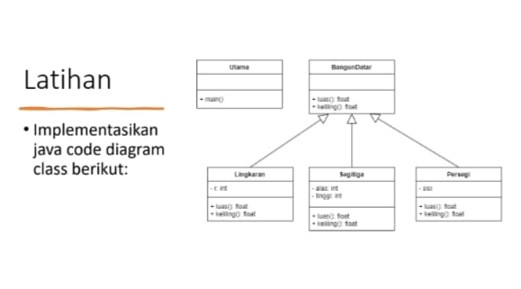

# Tugas Praktikum 5 (Pertemuan ke 6) 

|Nama|NIM|Kelas|Mata Kuliah|
|----|---|-----|------|
|**Romi Rahman**|**312310581**|**TI.23.A6**|**Pemrograman Orientasi Objek**|



#  • Implementasikan java code diagram class berikut :

##  • Class BangunDatar
```java
abstract class BangunDatar {
}
```
### Penjelasan :
```
- BangunDatar adalah kelas abstrak yang mewakili bentuk dasar dari sebuah bangun datar. Kelas ini dibuat abstrak karena kelas ini dimaksudkan untuk menjadi "kerangka dasar" bagi kelas-kelas bentuk spesifik (seperti Lingkaran, Segitiga, dan Persegi).
- Kelas abstrak tidak dapat diinstansiasi secara langsung dan umumnya berisi metode yang perlu diimplementasikan oleh kelas turunannya.
```

##  • Class Lingkaran
```java
class Lingkaran extends BangunDatar {
    int r; 

    Lingkaran(int r) {
        this.r = r;
    }

    float luas() {
        return (float) (Math.PI * r * r);
    }

    float keliling() {
        return (float) (2 * Math.PI * r);
    }
}
```
###  Penjelasan :
```
- Kelas Lingkaran adalah turunan dari BangunDatar.
- Variabel r mewakili radius (jari-jari) lingkaran.
- Constructor: Lingkaran(int r) adalah konstruktor yang menerima parameter r (jari-jari lingkaran) dan menginisialisasinya ke variabel anggota r.
- Method luas(): Menghitung luas lingkaran menggunakan rumus 𝜋 × 𝑟².
- Method keliling(): Menghitung keliling lingkaran menggunakan rumus 2 × π × r.
```

##  • Class Segitiga
```java
class Segitiga extends BangunDatar {
    int alas, tinggi;

    Segitiga(int alas, int tinggi) {
        this.alas = alas;
        this.tinggi = tinggi;
    }

    float luas() {
        return (float) (0.5 * alas * tinggi);
    }

    float keliling() {
        return 3 * alas;
    }
}
```
###  Penjelasan :
```
- Kelas Segitiga adalah turunan dari BangunDatar.
- Variabel alas dan tinggi mewakili alas dan tinggi segitiga.
- Constructor: Segitiga(int alas, int tinggi) menginisialisasi alas dan tinggi.
- Method luas(): Menghitung luas segitiga dengan rumus 1 per 2 × alas × tinggi.
- Method keliling(): Menghitung keliling segitiga. Dalam contoh ini, diasumsikan segitiga sama sisi sehingga kelilingnya adalah 3 × alas.
```

##  • Class Persegi 
```java
class Persegi extends BangunDatar {
    int sisi;

    Persegi(int sisi) {
        this.sisi = sisi;
    }

    float luas() {
        return sisi * sisi;
    }

    float keliling() {
        return 4 * sisi;
    }
}
```
###  Penjelasan :
```
- Kelas Persegi adalah turunan dari BangunDatar.
- Variabel sisi mewakili panjang sisi persegi.
- Constructor: Persegi(int sisi) menginisialisasi panjang sisi persegi.
- Method luas(): Menghitung luas persegi menggunakan rumus sisi × sisi.
- Method keliling(): Menghitung keliling persegi menggunakan rumus 4 × sisi.
```

##  • Class Utama ( Main Class ) 
```java
public class Utama {
    public static void main(String[] args) {
        Lingkaran lingkaran = new Lingkaran(7);
        Segitiga segitiga = new Segitiga(5, 10);
        Persegi persegi = new Persegi(4);

        System.out.println("Luas Lingkaran: " + lingkaran.luas());
        System.out.println("Keliling Lingkaran: " + lingkaran.keliling());
        System.out.println("Luas Segitiga: " + segitiga.luas());
        System.out.println("Keliling Segitiga: " + segitiga.keliling());
        System.out.println("Luas Persegi: " + persegi.luas());
        System.out.println("Keliling Persegi: " + persegi.keliling());
    }
}
```
###  Penjelasan :
```
- Utama adalah kelas utama (main class) yang mengandung metode main, titik awal eksekusi program.
- Di dalam main:
 - Objek lingkaran dari kelas Lingkaran dibuat dengan radius 7.
 - Objek segitiga dari kelas Segitiga dibuat dengan alas 5 dan tinggi 10.
 - Objek persegi dari kelas Persegi dibuat dengan panjang sisi 4.
 - Program mencetak hasil luas dan keliling dari setiap bentuk (lingkaran, segitiga, dan persegi) dengan memanggil metode luas() dan keliling() dari masing-masing objek.
```

# Output :

